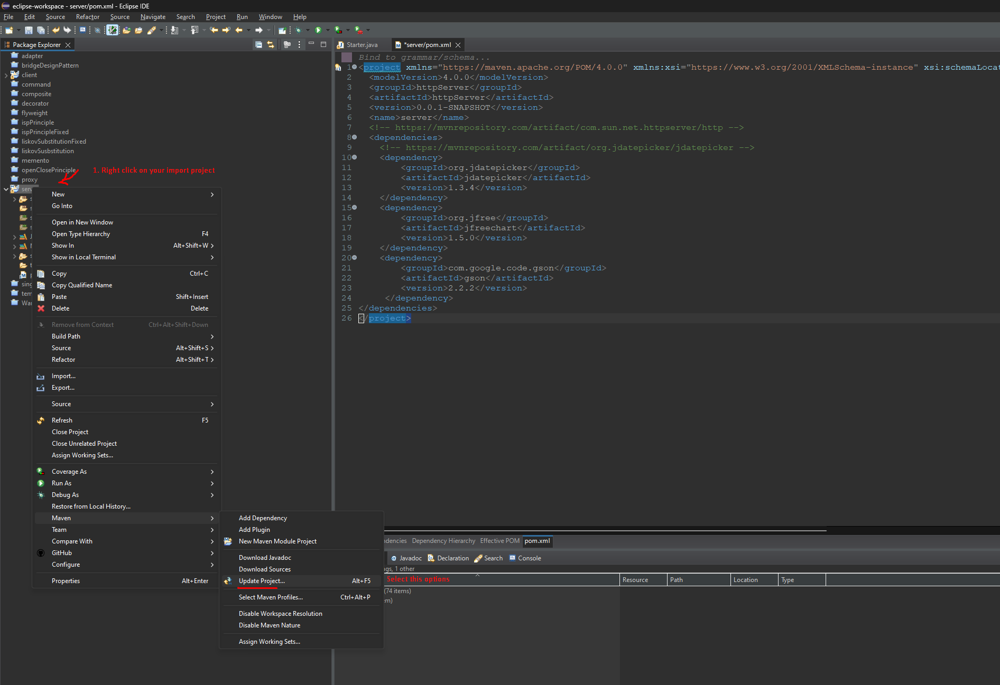
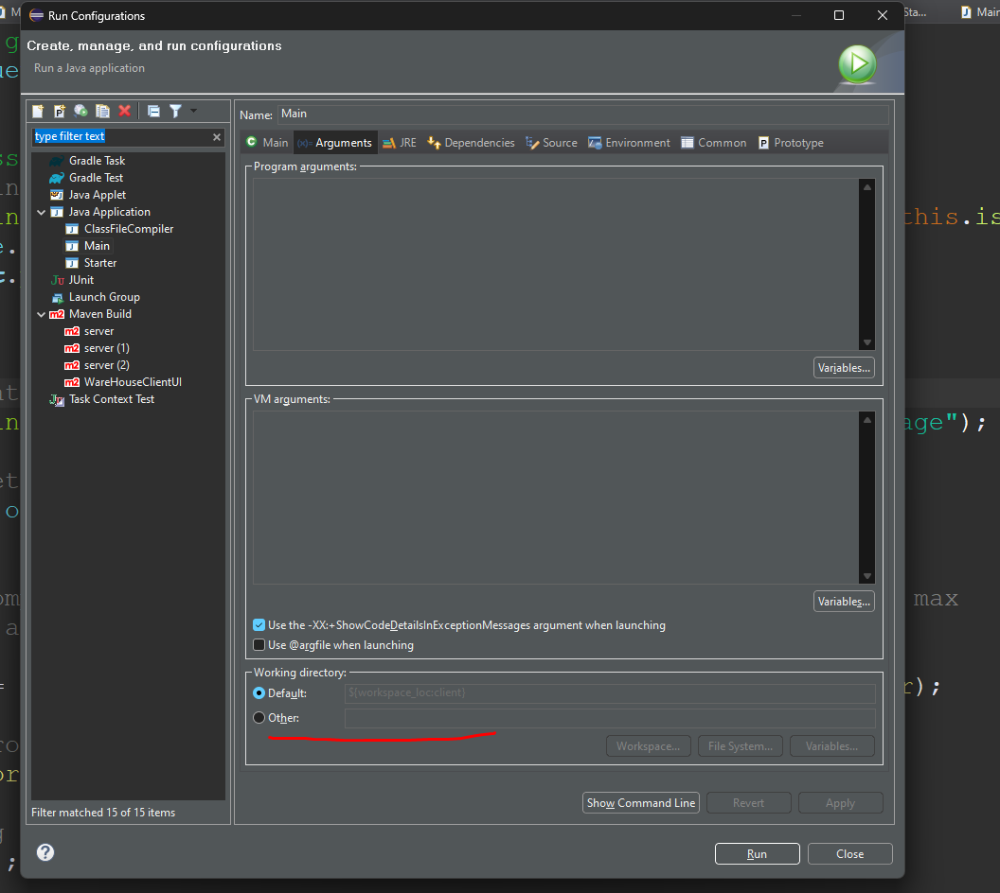
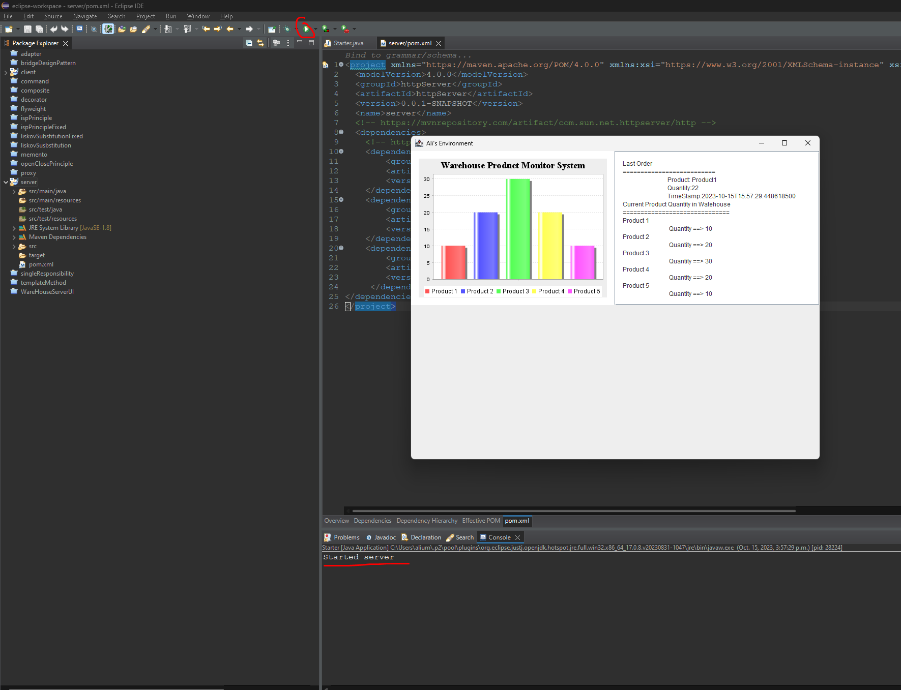

# EECS3311_Group_Project_WS

## Project Setup

#### Prerequisites

- Git https://git-scm.com/
- Eclipse community edition https://www.eclipse.org/community/
- Java https://www.oracle.com/ca-en/java/technologies/downloads/

#### Setup
1. Clone project
```
git clone https://github.com/Faizi-AdnanFahad/EECS3311_Group_Project_WS.git
```
2. Import projects into eclipse and then sync maven dependencies https://maven.apache.org/


3. Set your eclipse working directory to be the project root folder 


4. Run the project with eclipse generated run configuration
5. If everything is working as it should, you should have a JFrame show up as below :smiley:


