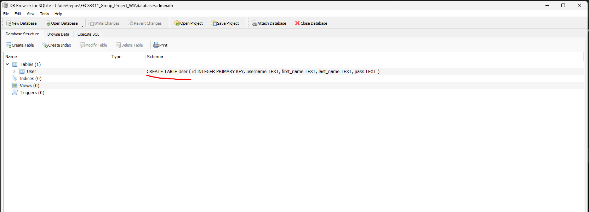

## Database

- Admin Database
- Product Database

#### To run
1. Open a CMD shell on your windows machine
2.
        cd $project_folder
3. This script should create product database and admin database

        ./database/setup.cmd

4. Connect to your newly created table using Sqlite3 DB Browser
   
